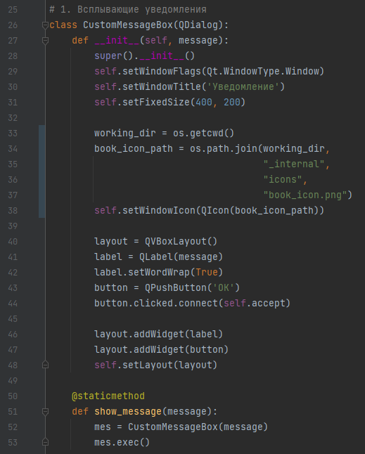
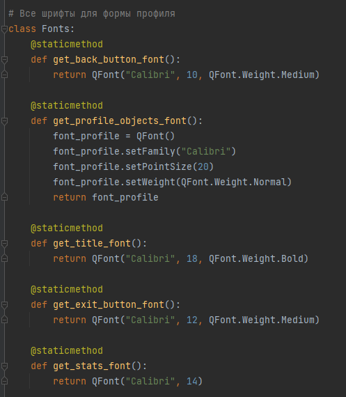
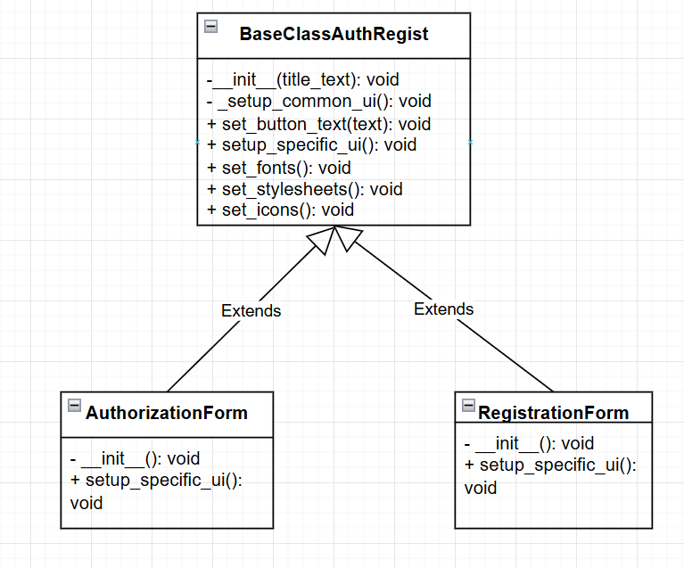
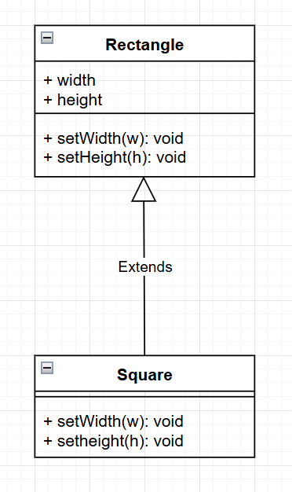
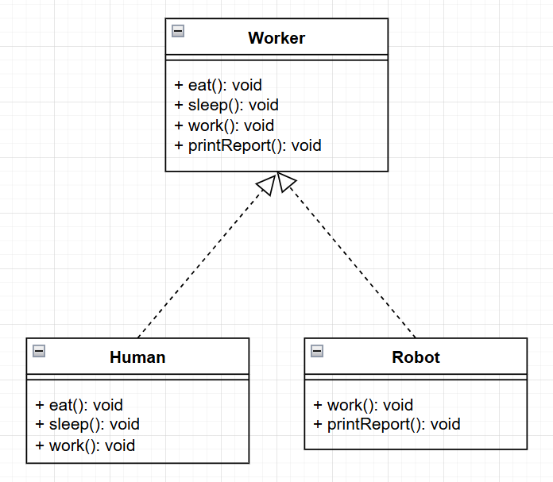
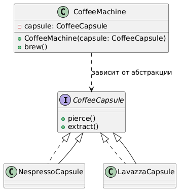
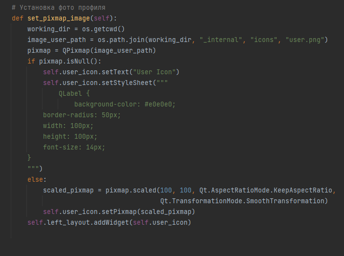
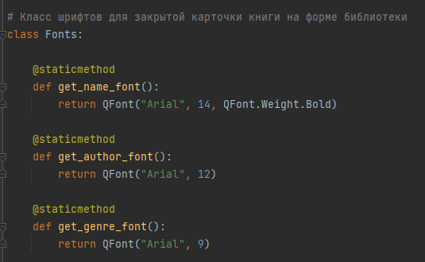
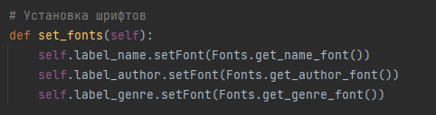

## В приложении соблюдаются ключевые принципы проектирования программного обеспечения.

---

### Принципы SOLID.

---

1. **Принцип единственной ответственности (S — Single Responsibility Principle)** реализован
за счёт чёткого разделения обязанностей между компонентами: например, класс ProfileWindow отвечает исключительно
за отображение профиля пользователя и взаимодействие с UI, тогда как логика работы с базой данных полностью
вынесена в модуль app.database.Requests. Это позволяет изолировать слои приложения — например, методы display_books()
и display_stats() в ProfileWindow лишь получают данные извне и визуализируют их, не вмешиваясь в процесс запроса к БД.
Нарушение этого принципа выглядело бы как встраивание SQL-запросов прямо в методы UI-класса: если бы в display_books()
появился код вроде cursor.execute("SELECT * FROM books..."), класс одновременно управлял бы и интерфейсом, и данными,
что усложнило бы поддержку и тестирование. Также хорошим примером будет класс CustomMessageBox, который занимается 
инициализацией объекта всплывающего сообщения и отправкой сообщения, нарушением было бы создание общего класса
приложения внутри которого была бы реализована функция создания всплывающего окна.

    

    Пример соблюдения принципа SRP с UML - диаграммой, здесь мы делим класс с множеством функций, на классы, каждый 
    из которых занят исключительно своим делом. Изначально все методы были в одном классе, под названием OrderService:

     

---

2. **Принцип открытости/закрытости (O — Open/Closed Principle)** также соблюдается: функциональность приложения можно
расширять без изменения существующего кода. Например, создание дополнительной формы авторизации через мессенджеры или
социальные сети будет расширять функционал BaseClassAuthRegist, однако уже имеющиеся классы и методы меняться не
будут. Соответственно этот принцип реализован в файле BaseClassAuthRegist.py. UML - диаграмма:

    

---

3. **Принцип Лискова (L - Liskov Substitution Principle)** - это правило, которое говорит: если есть код, работающий
с базовым классом, то он должен продолжать работать корректно, если вместо него подставить любой подтип, не зная об этой
замене. В моем коде нет такого явного родительского класса, наследника которого можно было бы заменить им. Есть
BaseClassAuthRegist, но он выполняет роль абстрактного класса. Так что в коде принцип соблюдается. Приведу пример, когда 
принцип может быть нарушен, с UML - диаграммой. Например, у нас есть класс Rectangle с полями width, height и методами 
setWidth, setHeight. И есть класс Square, который наследуется от Rectangle, переопределив методы так, чтобы при установке
высоты, ширина устанавливалась такой же и при установке ширины, высота устанавливалась такой же.
Например есть функция, которая предполагает, что на входе будет прямоугольник, то есть высота и ширина будут независимы,
функция как-то изменяет ширину и высоту, а затем проверяет, что высота и ширина разные. 
Если передать в неё экземпляр класса Square, логика работы пропадёт, на выходе получим ЛОЖЬ, принцип Лискова будет
нарушен.

    

---

4. **Interface Segregation Principle (ISP) — принцип разделения интерфейсов**: клиенты (классы, которые используют 
интерфейс) не должны зависеть от методов, которые они не используют. Другими словами, не нужно делать интерфейсы с кучей
методов. Лучше сделать несколько маленьких и дать каждому классу ровно тот набор, который ему действительно требуется.
В моем коде нет интерфейсов, которые бы имело место разделить на более маленькие, поэтому код соблюдает данный принцип.
Покажу пример с UML - диаграммой, когда данный принцип нарушается: Допустим есть интерфейс Worker с методами eat(),
sleep(), work(), printReport(). И есть два класса, Robot и Human. Robot по сути должен только work() и printReport(),
Human, должен work(), eat(), sleep(). Если оба класса вынуждены реализовывать Worker, то Robot будет вынужден также
реализовывать eat(), sleep(), а Human должен будет также реализовывать printReport(). В итоге классы реализуют не нужные
для них методы, появляется риск ошибок NotImplementedError и т.д. В приведённом примере нарушен принцип ISP.
UML - диаграмма к примеру:

    

   Принцип будет соблюдён, если вместо одного большого интерфейса создать много маленьких, выполняющих одну функцию,
интерфейсы: eat, slip, work, printReport. А затем каждый класс реализует только то, что требуется ему. 

---

5. **Dependency Inversion Principle (DIP) — «принцип инверсии зависимостей»**: модули высокого уровня не должны зависеть
от модулей низкого уровня; оба должны зависеть от абстракций. В моём коде нет зависимостей, которые можно было бы
явно направить к какому-то интерфейсу, однако, я могу привести пример, когда такой принцип действительно нужен и 
соблюдается. Представим, что у нас есть класс CoffeeMachine, с методом brew() и полем NespressoCapsule. В данном 
случае модуль высокого уровня (Кофемашина) зависит от модуля низкого уровня (Капсула), что нарушает принцип DIP. Будет
правильно, если мы создадим отдельный интерфейс для капсул, каждая капсула будет реализовывать его методы. А при 
использовании капсулы, кофемашина не будет "знать", что за капсула внутри. UML - диаграмма примера:

   
---

### Принципы KISS, DRY

---

1. Принцип KISS (Keep It Simple, Stupid) последовательно применяется в архитектуре приложения. Код остаётся простым и
понятным: методы невелики по объёму и выполняют в основном одну задачу, избегая избыточной сложности. Например,
метод set_pixmap_image() содержит линейную последовательность действий — получение пути к изображению, загрузка,
обработка ошибки отсутствия файла, масштабирование и установка пиктограммы — без лишних абстракций. Нарушение KISS могло
бы выглядеть как внедрение сложных паттернов там, где они не нужны: например, создание целой иерархии классов
ImageLoaderStrategy для простой операции QPixmap(path) только усложнило бы код без практической пользы. 
Пример из кода класса Profile:

   

---

2. Принцип DRY (Don’t Repeat Yourself) соблюдается за счёт централизации повторяющейся логики. Так, все настройки
шрифтов для UI вынесены в класс Fonts со статическими методами, что исключает дублирование при установке шрифтов для
разных элементов интерфейса. В методе set_fonts() каждый виджет получает шрифт из единого источника — это упрощает
поддержку и внесение изменений. Нарушение DRY проявилось бы в прямом дублировании кода установки шрифтов для каждого
виджета отдельно: если бы в set_fonts() для каждой кнопки и метки вручную создавался
QFont("Calibri", 10, QFont.Weight.Medium) и т. п., это привело бы к избыточности и рискам расхождения
настроек при правках. Пример из кода класса BookCard, по сути здесь повторений не было бы если создавать
Font каждый раз при создании элемента, однако если расширить количество элементов, шрифты останутся те же, 
будет много повторений:

   
 
   
